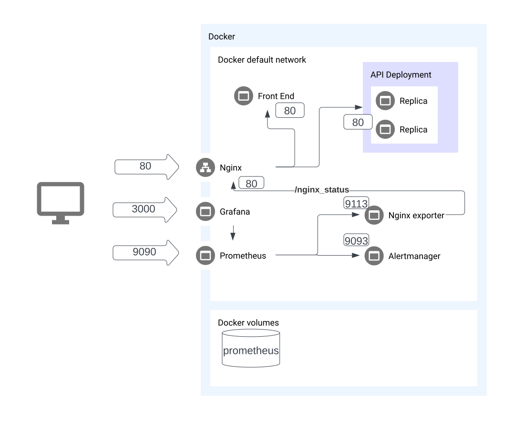

#  my_voice

Проект по машинному обучению на хакатон

## TOC
- [Ручные запуски](#%D1%80%D1%83%D1%87%D0%BD%D1%8B%D0%B5-%D0%B7%D0%B0%D0%BF%D1%83%D1%81%D0%BA%D0%B8)
    - [Backend](#backend)
- [Деплой](#%D0%B4%D0%B5%D0%BF%D0%BB%D0%BE%D0%B9)
- [Инфраструктура](#%D0%B8%D0%BD%D1%84%D1%80%D0%B0%D1%81%D1%82%D1%80%D1%83%D0%BA%D1%82%D1%83%D1%80%D0%B0)

## Ручные запуски
### Backend
  ```bash
  cd backend
  pip install -r requirements.txt
  python main.py
  ```

## Деплой

Заполни секреты в `infrastructure/prometheus/alertmanager.yml` и запусти:

```bash
  docker-compose up
```

- Frontend: [localhost:80](localhost:80)
- Backend (behind nginx load balancer): [localhost:8080](localhost:8080)
- Prometheus: [localhost:9090](localhost:9090)
- Grafana: [localhost:3000](localhost:3000)

## Инфраструктура




