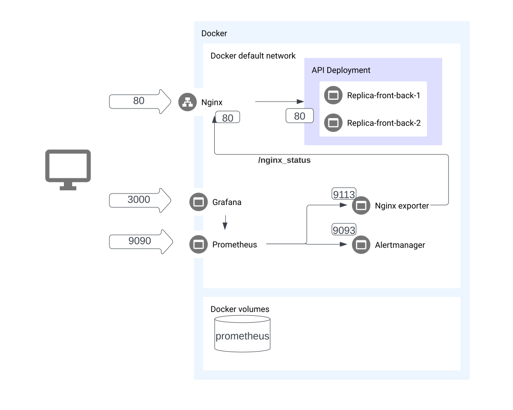

#  my_voice

Проект по машинному обучению на хакатон

## TOC

- [Окружение](#окружение)
- [Ручные запуски](#%D1%80%D1%83%D1%87%D0%BD%D1%8B%D0%B5-%D0%B7%D0%B0%D0%BF%D1%83%D1%81%D0%BA%D0%B8)
  - [Backend](#backend)
  - [Отдельно frontend](#отдельно-frontend)
  - [Отдельно инфер на небольшой наборе данных](#отдельно-инфер-на-небольшом-наборе-данных)
- [Деплой](#%D0%B4%D0%B5%D0%BF%D0%BB%D0%BE%D0%B9)
  - [1. Используя docker](#1-используя-docker)
  - [2. Используя docker compose](#2-используя-docker-compose)
    - [С мониторингом](#с-мониторингом)
    - [Без мониторинга](#без-мониторинга)
- [Инфраструктура](#%D0%B8%D0%BD%D1%84%D1%80%D0%B0%D1%81%D1%82%D1%80%D1%83%D0%BA%D1%82%D1%83%D1%80%D0%B0)

## Окружение

python3.10  
WSL2 Ubuntu с Docker Desktop

## Ручные запуски

### Backend

Пути:

- `localhost:80/docs` Swagger API
- `localhost:80/v1` Swagger API
- `localhost:80/static` Frontend

Запуск:

```bash
cd backend
pip install -r requirements.txt
python main.py
```

### Отдельно frontend

Открыть `index.html` из папки `frontend`

### Отдельно инфер на небольшом наборе данных

```bash
cd backend
pip install -r requirements.txt
python example_infer.py
```

## Деплой

### 1. Используя Docker

Только образ с front/end без мониторинга

```bash
  docker build -t hackathon-api .
  docker run -it --name hackathon -p 5000:5000 hackathon-api
```

### 2. Используя Docker compose

#### С мониторингом

Заполни секреты в `infrastructure/prometheus/alertmanager.yml` и запусти:

```bash
  docker-compose -f docker-compose.yaml up
```

#### Без мониторинга

Отсутствуют Grafana, Prometheus и связанные с ними внутренний сервисы (алерт менеджер, nginx экспортер)

```bash
  docker-compose -f docker-compose-no-monitoring.yaml up
```

## Инфраструктура



Список доступных снаружи сервисов:

- Backend/Frontend (в контейнерах за лоад балансеров): [localhost:80](localhost:8080)
- Prometheus: [localhost:9090](localhost:9090)
- Grafana: [localhost:3000](localhost:3000)

Список внутренних сервисов недоступных снаружи:

- Alertmanager
- Nginx Exporter
